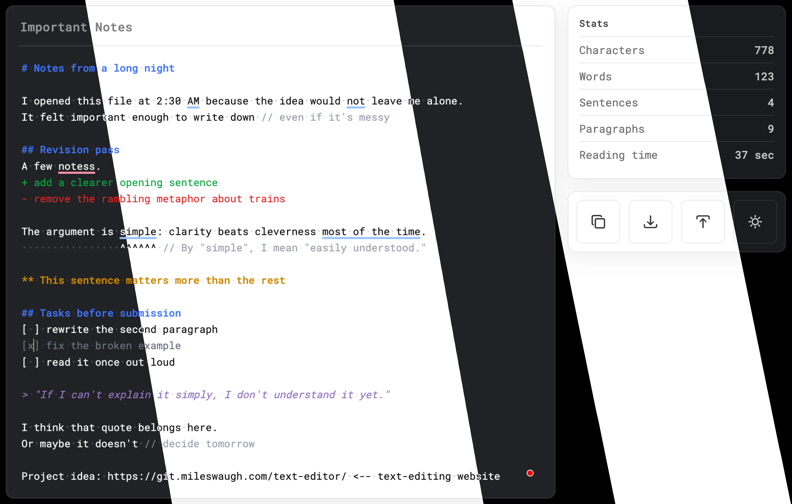

# Minimal Text Editor

Just a simple, minimal text editor.

## Project Thumbnail

This is two screenshots of the text editor, in light and dark mode, composited together in GIMP.

## Action Buttons

I made these icons myself, inspired by icons I saw on Google.

## Logo

The site favicon is a stylized calligraphic capital T, typeset in [Zapfino](https://en.wikipedia.org/wiki/Zapfino).

